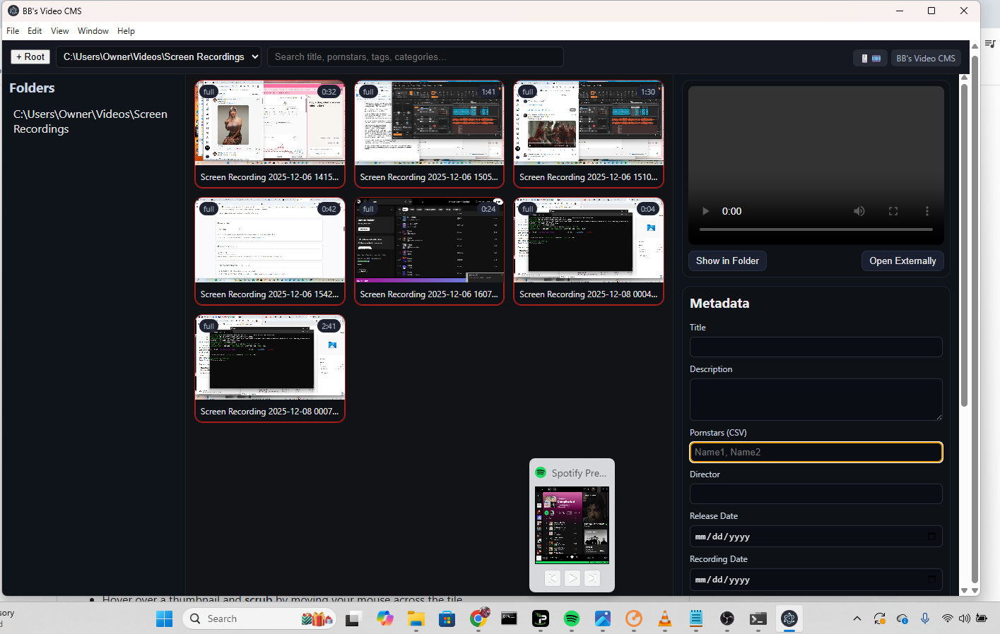

# BBS Video CMS (Electron)

Complete replacement for Windows Explorer or File Finder

A file-level video CMS with **hover scrubbing**, **XMP/TXT sidecars**, **right‑click transcode/upload actions**, **color‑coded thumbnails** (full/trailer/footage), **search**, and a **built-in player**.



## Quick start
```bash
npm install
npm start
```
> If you plan to use the transcode actions, install `ffmpeg` and `ffprobe` and put them on your PATH or set `FFMPEG_PATH` and `FFPROBE_PATH` env vars.

## Features
- File explorer rooted at folders from `config.json` → `"roots"`
- Hover over a thumbnail and **scrub** by moving your mouse across the tile
- Edit metadata in the right panel and **Save Sidecars** → creates:
  - `video.xmp` (minimal XMP with `dc:*`, `xmp:*`, and custom `av:*` fields)
  - `video.meta.txt` (Title, Description, Pornstars, Director)
- Context menu (right‑click) per file:
  - Transcode 1080p / 4K / SD / Unwatermarked (scripts in `/actions`)
  - Upload to… (stub script; adapt to your infra, e.g. `rclone`/S3)
- Color borders: **red** = full, **yellow** = trailer, **gray** = footage
- Search across name/title/description/pornstars/tags/categories/sex rating
- Built-in player panel

## Configure roots
Edit `config.json` and add your library folders under `"roots"`. You can also click `+ Root` in-app to add one for the current session.

## Sidecar schema (XMP)
The XMP uses common namespaces plus a custom `av:` namespace:
- `dc:title`, `dc:description`, `dc:subject` (keywords/tags)
- `xmp:Rating` (0–5), `xmpDM:shotName`
- `av:Director`, `av:SexRating` (`non-nude|softcore|masturbation|hardcore XXX`)
- `av:AssetType` (`full|trailer|footage`) → drives thumbnail border color
- `av:ReleaseDate`, `av:RecordingDate`
- `av:Pornstars` (rdf:Bag), `av:Categories` (rdf:Bag)

> Premiere reads standard `dc:*` and some `xmp:*` fields; custom `av:*` are for your app but remain in a plain, portable XMP sidecar.

## Actions
Edit the scripts in `/actions/*.bat` or `/*.sh`. They receive the **file path** as the first argument. The provided scripts are simple templates—tune bitrates, codecs, watermarks, etc.

## Notes
- Hover scrubbing uses `<video>` fast seeks—quality depends on codec/seek index.
- Poster is drawn by seeking to ~5% of duration and painting to `<canvas>`.
- For very large dirs, consider paging or pre-indexing (future enhancement).
- SMB/NFS/S3 providers can be plugged into `main.js` and `preload.js` as needed.
